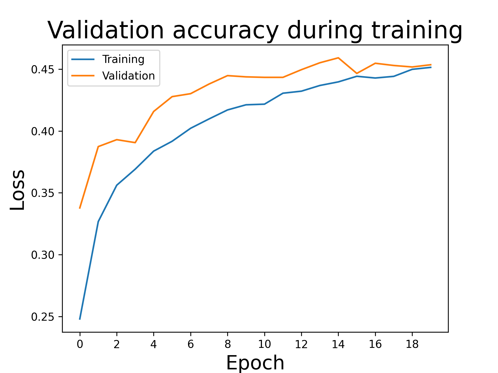
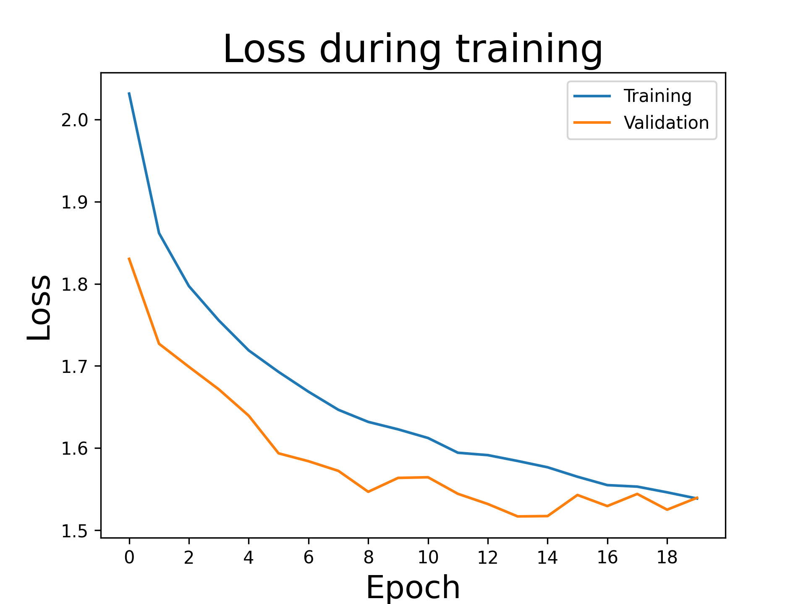
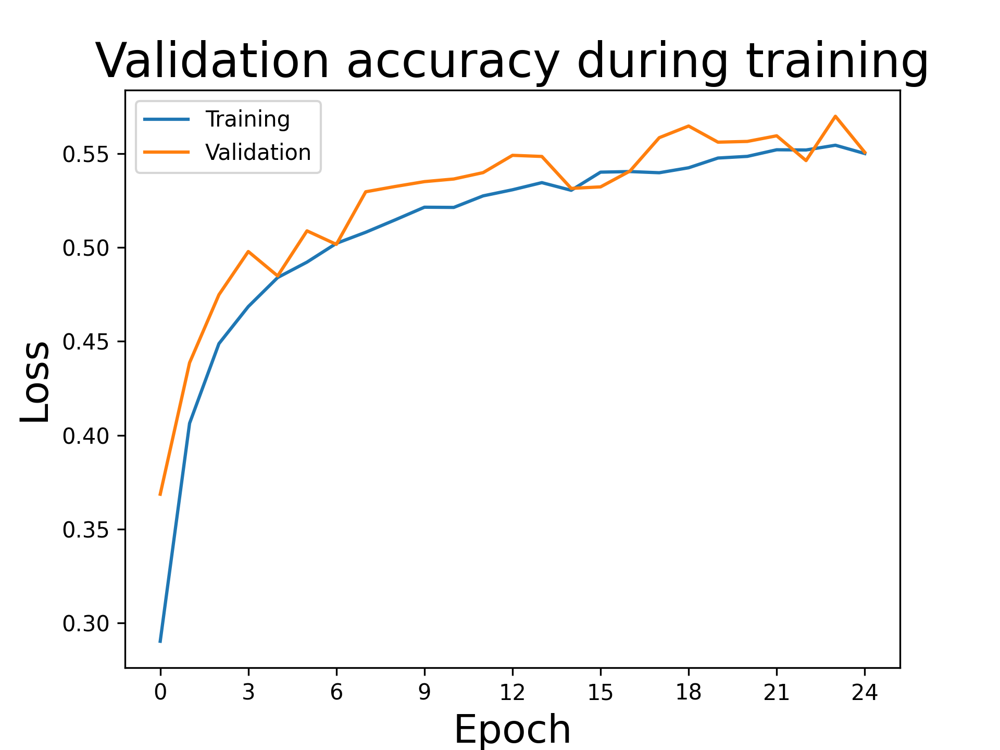
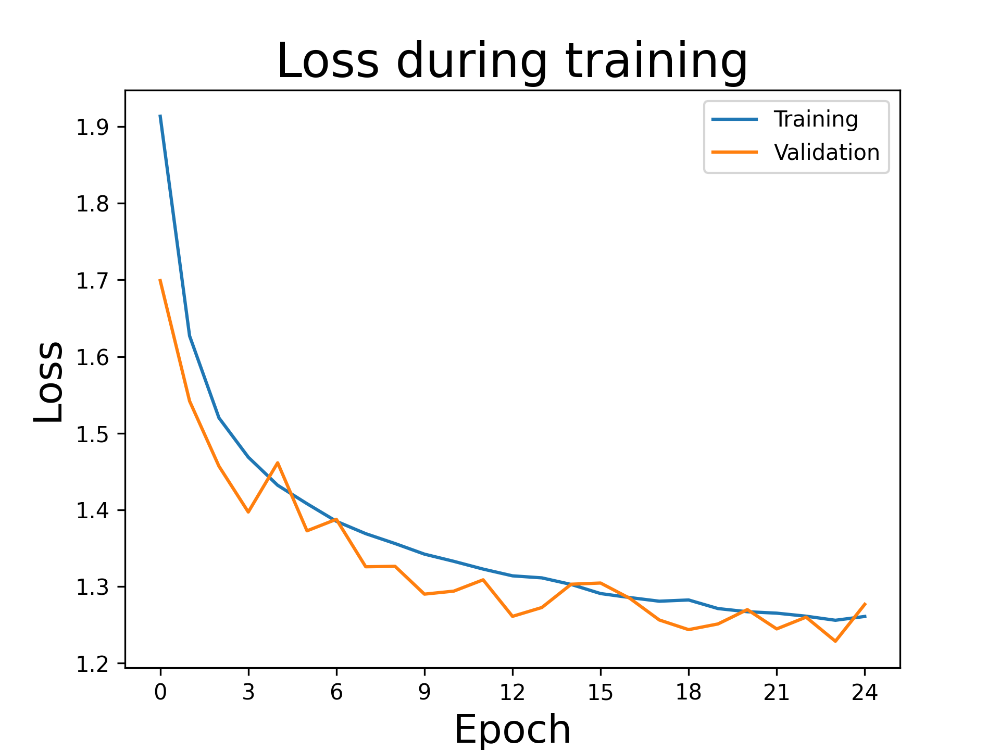
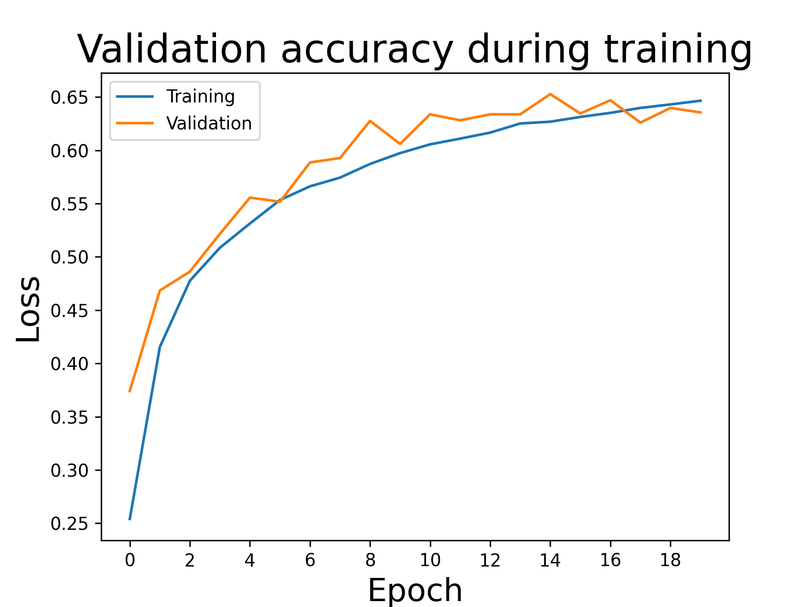
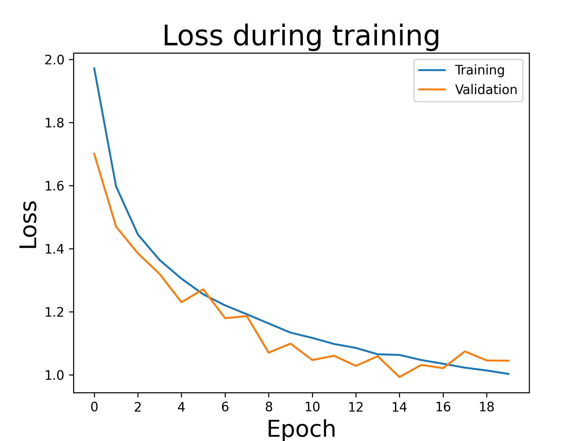
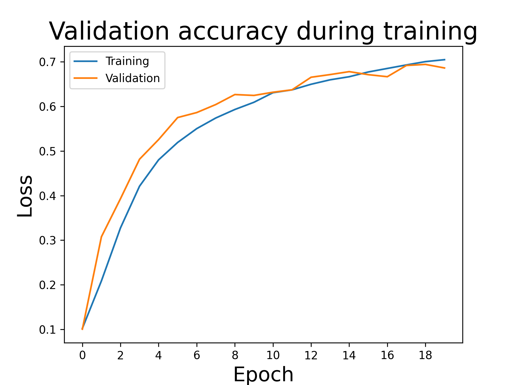
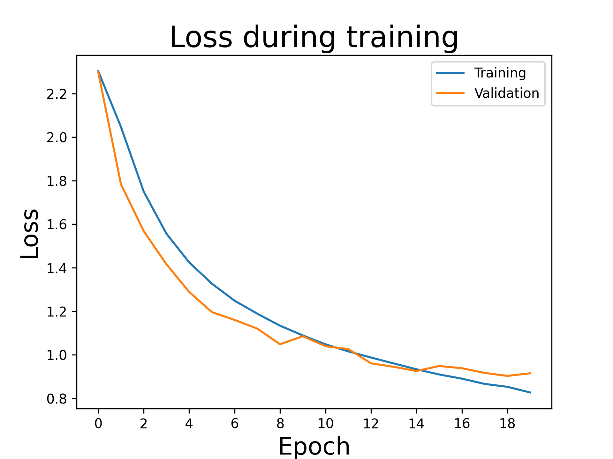

# Introduction
This is my submission for the "Create Your Own Image Classifier 2.0" project as part of the Udacity nanodegree [Introduction to Machine Learning with PyTorch](https://learn.udacity.com/nanodegrees/nd229).  The point of this project is to demonstrate understanding of deep learning concepts and the `pytorch` library through a toy classification task.  The task is to develop an image classifier that will work on the CIFAR-10 dataset.  The problem setup also includes a small discussion on whether it makes sense to develop a model in-house vs purchasing one from a vendor.

# Setup

Set up the `pyenv` virtual environment.

```
# set up new virtual environment
pyenv virtualenv 3.11.7 udacity-cifar10-classifier
pyenv local udacity-cifar10-classifier
python3 -m pip install --upgrade pip

# clone repo and install requirements.
git clone git@github.com:mrperkett/udacity-project-create-image-classifier-cifar-10.git
cd udacity-project-create-image-classifier-cifar-10
python3 -m pip install -r requirements.txt

# register IPython kernel
python3 -m ipykernel install --user --name udacity-flower-classifier
```

## Jupyter
For this project, I used the `VSCode` Jupyter extension (v2024.4.0) to run the Jupyter notebook. There are other options for running Jupyter notebooks. For another option using pyenv and the jupyter lab via the command line, see [this repo](https://github.com/mrperkett/udacity-project-finding-donors).

# Running
You can run the Jupyter notebook [CIFAR-10_Image_Classifier-STARTER.ipynb](CIFAR-10_Image_Classifier-STARTER.ipynb) in the usual way; see setup section for details.  See [CIFAR-10_Image_Classifier-STARTER.html](CIFAR-10_Image_Classifier-STARTER.html) for an HTML export of the notebook.

# Results
View the Jupyter notebook [CIFAR-10_Image_Classifier-STARTER.ipynb](CIFAR-10_Image_Classifier-STARTER.ipynb) for a summary of the results.  I have recorded below the performance of the five different classifiers tested in this notebook for reference

## Classifier01

```python
class Classifier01(nn.Module):
    """
    Define a simple 5-layer fully-connected neural network
    number of input units = (3 channels) * (32 width) * (32 height) = 3072
    """
    def __init__(self):
        super().__init__()
        self.fc1 = nn.Linear(3072, 512)
        self.fc2 = nn.Linear(512, 256)
        self.fc3 = nn.Linear(256, 128)
        self.fc4 = nn.Linear(128, 64)
        self.fc5 = nn.Linear(64, 10)

        self.dropout = nn.Dropout(p=0.2)
        
    def forward(self, x):
        # flatten the input tensor
        x = x.view(x.shape[0], -1)

        # use the rectified linear unit function as the activation function and log softmax to get probabilities
        # of each class at the end
        x = self.dropout(F.relu(self.fc1(x)))
        x = self.dropout(F.relu(self.fc2(x)))
        x = self.dropout(F.relu(self.fc3(x)))
        x = self.dropout(F.relu(self.fc4(x)))

        # output should not have any dropout
        x = F.log_softmax(self.fc5(x), dim=1)
        
        return x
```

```
epoch       run_time    train_loss  train_acc   valid_loss  valid_acc   
0           36.9        2.0315      0.2480      1.8303      0.3378      
4           36.4        1.7189      0.3837      1.6395      0.4158      
9           35.6        1.6228      0.4212      1.5637      0.4438      
14          38.5        1.5767      0.4397      1.5173      0.4592      
19          37.0        1.5386      0.4515      1.5395      0.4536      
total_run_time: 735.5073757171631
```





## Classifier02

```python
class Classifier02(nn.Module):
    """
    This is a copy and paste from the pytorch tutorial
    https://pytorch.org/tutorials/beginner/blitz/cifar10_tutorial.html
    """
    def __init__(self):
        super().__init__()
        self.conv1 = nn.Conv2d(3, 6, 5)
        self.pool = nn.MaxPool2d(2, 2)
        self.conv2 = nn.Conv2d(6, 16, 5)
        self.fc1 = nn.Linear(16 * 5 * 5, 120)
        self.fc2 = nn.Linear(120, 84)
        self.fc3 = nn.Linear(84, 10)

    def forward(self, x):
        x = self.pool(F.relu(self.conv1(x)))
        x = self.pool(F.relu(self.conv2(x)))
        x = torch.flatten(x, 1) # flatten all dimensions except batch
        x = F.relu(self.fc1(x))
        x = F.relu(self.fc2(x))
        x = self.fc3(x)
        return x
```

```
epoch       run_time    train_loss  train_acc   valid_loss  valid_acc   
0           40.3        1.9136      0.2903      1.6991      0.3686      
4           34.9        1.4321      0.4839      1.4614      0.4848      
9           34.9        1.3423      0.5214      1.2901      0.5350      
14          35.1        1.3027      0.5304      1.3030      0.5314      
19          34.8        1.2712      0.5476      1.2512      0.5560      
24          35.1        1.2610      0.5500      1.2768      0.5506      
total_run_time: 880.8583290576935
```





## Classifier03

```python
class Classifier03(nn.Module):
    """
    Modified from Classifier02 to have more output channels in the convulutional
    layers and an additional fully connected layer.
    """
    def __init__(self):
        super().__init__()
        self.conv1 = nn.Conv2d(3, 12, 5)
        self.pool = nn.MaxPool2d(2, 2)
        self.conv2 = nn.Conv2d(12, 32, 5)
        self.fc1 = nn.Linear(32 * 5 * 5, 350)
        self.fc2 = nn.Linear(350, 120)
        self.fc3 = nn.Linear(120, 84)
        self.fc4 = nn.Linear(84, 10)

    def forward(self, x):
        x = self.pool(F.relu(self.conv1(x)))
        x = self.pool(F.relu(self.conv2(x)))
        x = torch.flatten(x, 1) # flatten all dimensions except batch
        x = F.relu(self.fc1(x))
        x = F.relu(self.fc2(x))
        x = F.relu(self.fc3(x))
        x = self.fc4(x)
        return x
```

```
epoch       run_time    train_loss  train_acc   valid_loss  valid_acc   
0           39.6        1.9718      0.2540      1.7006      0.3740      
4           38.3        1.3049      0.5313      1.2301      0.5556      
9           38.5        1.1338      0.5974      1.0990      0.6060      
14          38.3        1.0631      0.6269      0.9929      0.6528      
19          38.9        1.0028      0.6466      1.0447      0.6356      
total_run_time: 775.0359513759613
```





## Classifier04

```python
class Classifier04(nn.Module):
    """
    Modified from Classifier04 to have an additional convulutional layer and an 
    additional output layer.    
    """
    def __init__(self):
        super().__init__()
        self.conv1 = nn.Conv2d(3, 12, 2)
        self.pool = nn.MaxPool2d(2, 2)
        self.conv2 = nn.Conv2d(12, 32, 2)
        self.conv3 = nn.Conv2d(32, 64, 2)
        self.fc1 = nn.Linear(2304, 1024)
        self.fc2 = nn.Linear(1024, 512)
        self.fc3 = nn.Linear(512, 256)
        self.fc4 = nn.Linear(256, 84)
        self.fc5 = nn.Linear(84, 10)

    def forward(self, x):
        x = self.pool(F.relu(self.conv1(x)))
        x = F.relu(self.conv2(x))
        x = self.pool(F.relu(self.conv3(x)))
        x = torch.flatten(x, 1) # flatten all dimensions except batch
        x = F.relu(self.fc1(x))
        x = F.relu(self.fc2(x))
        x = F.relu(self.fc3(x))
        x = F.relu(self.fc4(x))
        x = self.fc5(x)
        return x
```

```
epoch       run_time    train_loss  train_acc   valid_loss  valid_acc   
0           46.8        2.3030      0.1022      2.2996      0.1004      
4           45.0        1.4250      0.4801      1.2893      0.5256      
9           46.6        1.0893      0.6092      1.0856      0.6246      
14          57.0        0.9339      0.6666      0.9259      0.6780      
19          48.1        0.8274      0.7048      0.9154      0.6862      
total_run_time: 986.1806242465973
```




## Classifier05

```python
class Classifier05(nn.Module):
    """
    Modified from Classifier04 to include dropout. 
    """
    def __init__(self):
        super().__init__()
        self.pool = nn.MaxPool2d(2, 2)
        self.dropout = nn.Dropout(p=0.15)

        self.conv1 = nn.Conv2d(3, 12, 2)
        self.conv2 = nn.Conv2d(12, 32, 2)
        self.conv3 = nn.Conv2d(32, 64, 2)
        self.fc1 = nn.Linear(2304, 1024)
        self.fc2 = nn.Linear(1024, 512)
        self.fc3 = nn.Linear(512, 256)
        self.fc4 = nn.Linear(256, 84)
        self.fc5 = nn.Linear(84, 10)

    def forward(self, x):
        x = self.pool(self.dropout(F.relu(self.conv1(x))))
        x = self.dropout(F.relu(self.conv2(x)))
        x = self.pool(self.dropout(F.relu(self.conv3(x))))
        x = torch.flatten(x, 1) # flatten all dimensions except batch
        x = self.dropout(F.relu(self.fc1(x)))
        x = self.dropout(F.relu(self.fc2(x)))
        x = self.dropout(F.relu(self.fc3(x)))
        x = self.dropout(F.relu(self.fc4(x)))
        x = self.fc5(x)
        return x
```

```
epoch       run_time    train_loss  train_acc   valid_loss  valid_acc   
0           52.3        2.1744      0.1600      1.9672      0.2474      
4           50.8        1.4309      0.4825      1.2995      0.5456      
9           50.8        1.1918      0.5804      1.0745      0.6258      
14          50.3        1.0705      0.6245      0.9979      0.6588      
19          50.5        0.9972      0.6530      0.9280      0.6732      
24          50.7        0.9396      0.6722      0.8878      0.6964      
total_run_time: 1268.37437748909
```


# Data

[PyTorch: Training a Classifier](https://pytorch.org/tutorials/beginner/blitz/cifar10_tutorial.html)

[The CIFAR-10 dataset](https://www.cs.toronto.edu/~kriz/cifar.html)